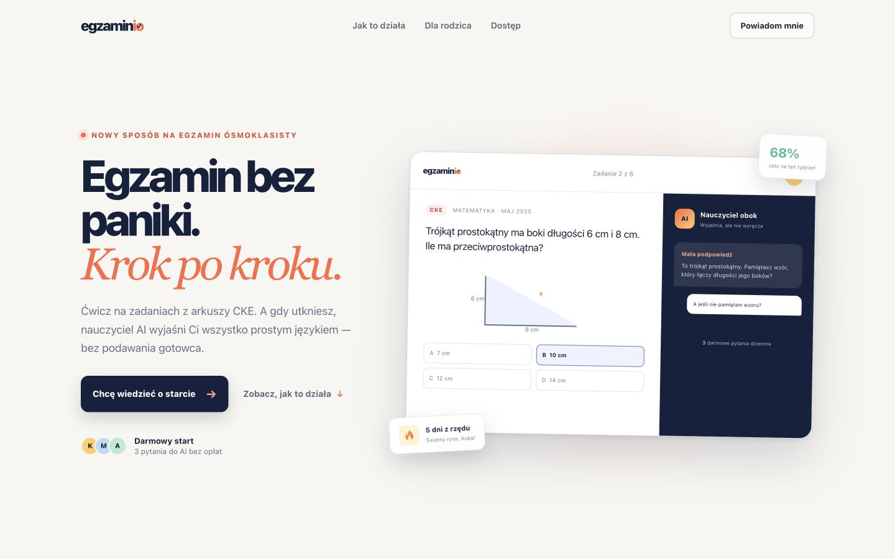
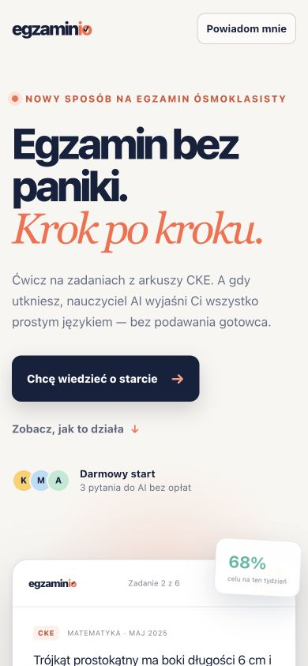

# egzaminio

Teaser aplikacji do przygotowania ósmoklasistów do egzaminu. Produkt łączy ćwiczenia oparte na arkuszach CKE z nauczycielem AI, który udziela podpowiedzi i wyjaśnia rozwiązania krok po kroku.

Interfejs korzysta z lokalnych komponentów shadcn/ui na Tailwind CSS 4. Wzory TeX/MathML renderuje przypięty MathJax 4 z rozszerzeniami bezpieczeństwa i dostępności.

## Podgląd

### Desktop



### Mobile



## Uruchomienie

Projekt wymaga Node.js 22.13 lub nowszego.

```bash
npm install
npm run dev
```

Strona będzie dostępna pod adresem `http://localhost:3000`.

## Docker

Obraz produkcyjny korzysta z wieloetapowego buildu i uruchamia wyłącznie serwer standalone na porcie `3000`.

```bash
docker build -t egzaminio .
docker run --rm -p 3000:3000 egzaminio
```

Po uruchomieniu:

- strona: `http://localhost:3000`
- health check: `http://localhost:3000/api/health`

Szczegółowa instrukcja wdrożenia znajduje się w [docs/coolify-deployment.md](docs/coolify-deployment.md).

Kompletna konfiguracja Hetzner, domeny, firewalla, Coolify, Supabase i OAuth: [docs/hetzner-domain-coolify-setup.md](docs/hetzner-domain-coolify-setup.md).

## Konta i role

Logowanie korzysta z tego samego stacku co kancelio.pl: Supabase Auth, PostgreSQL i Row Level Security. Dostępne są:

- własna rejestracja przez e-mail i hasło,
- logowanie przez Google,
- logowanie przez Facebook,
- role: uczeń, rodzic, nauczyciel i administrator,
- osobne panele startowe dla każdej roli.

Konfiguracja Supabase, providerów OAuth i administratora jest opisana w [docs/supabase-auth-setup.md](docs/supabase-auth-setup.md).

Strategia wejścia na rynek znajduje się w [docs/marketing-strategy-mvp.md](docs/marketing-strategy-mvp.md).

Etapowy plan funkcjonalności produktu znajduje się w [docs/mvp-implementation-plan.md](docs/mvp-implementation-plan.md).

Roboczy pakiet prawny (prywatność, regulamin, cookies, dzieci i AI oraz odstąpienie od umowy) jest dostępny pod `/informacje-prawne`. Dokumenty są celowo wyłączone z indeksowania do czasu uzupełnienia danych operatora, dostawców i konsultacji prawnej.

## Weryfikacja

```bash
npm run build
```

## Ważne

egzaminio jest niezależnym projektem edukacyjnym i nie jest powiązany z Centralną Komisją Egzaminacyjną.
